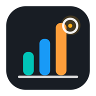
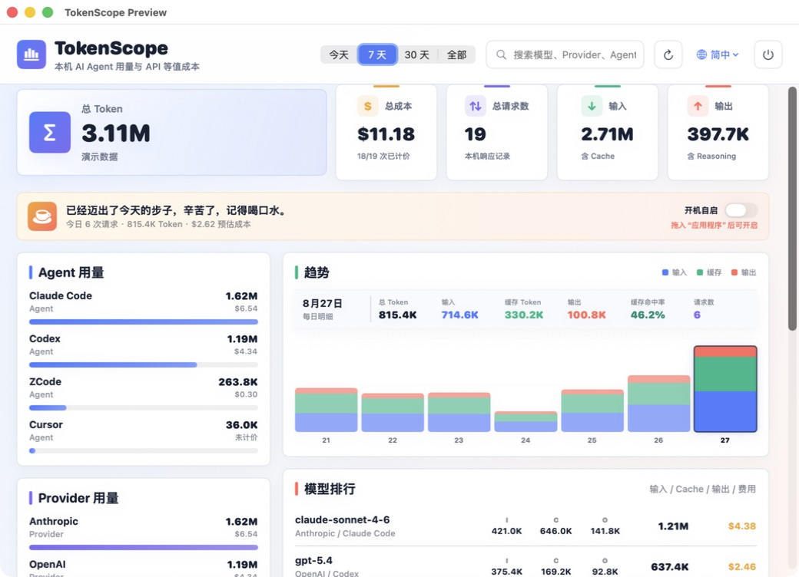
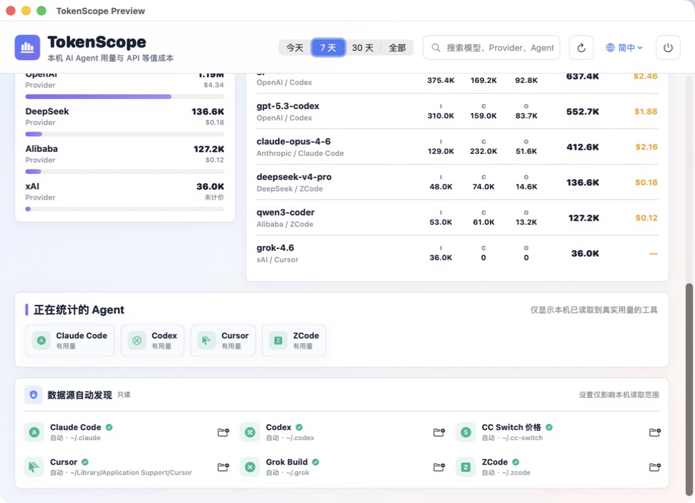

English | [简体中文](README.zh-cn.md)

<p align="center">
  
</p>

<h1 align="center">TokenScope</h1>

<p align="center">A local macOS panel for AI agent token usage, request counts, and API-equivalent cost. Opens a main window on launch and stays in the menu bar after closing.</p>

<p align="center">
  <a href="https://github.com/ckcsec/TokenScope/releases/latest"></a>
  
  
  <a href="LICENSE"></a>
</p>



## Download & Install

Download the latest `TokenScope-*-macOS-universal.dmg` from [GitHub Releases](https://github.com/ckcsec/TokenScope/releases/latest), open it, and drag TokenScope into the Applications folder.

Current public packages are locally signed and not yet notarized by Apple. If macOS blocks the first launch, right-click TokenScope in Finder, choose **Open**, and confirm. Do not download installers from third-party sites other than this repository.

Requirements: macOS 13 Ventura or later, Apple Silicon and Intel Macs. See the [release notes](RELEASE_NOTES.md) for version changes.

## Features

- Opens a main window on launch; closing it keeps the app in the menu bar — click the icon to reopen, right-click to quit
- Totals for tokens, input, output, cache, request count, and API-equivalent cost
- Usage broken down by agent, provider, model, and date
- Trend chart with per-day tokens, cached tokens, cache hit rate, and requests on hover
- Instant switching between Simplified Chinese, Traditional Chinese, and English
- Background resident; the user can opt in to launch at login
- Local cache and incremental scanning keep large history logs fast to open
- Only shows data sources that actually yielded usage — no preset lists pretending to be supported
- Pricing table auto-updates from this repository every 24 hours and falls back to built-in public model prices on failure (can be disabled in settings); the built-in table covers mainstream models such as GPT-5.6, Claude Opus 5, Gemini, Grok, GLM-5.3, Kimi K3, Qwen, and DeepSeek
- Pricing loop: `pricing.json` is automatically extended with new models from the [models.dev](https://models.dev) community catalog every week ([`scripts/update_pricing.py`](scripts/update_pricing.py) + workflow); existing prices are never overwritten, and official repricings are synced to the built-in table manually

## Data Sources

| Data source | Local location | Stats | Cost basis |
| --- | --- | --- | --- |
| Claude Code | `~/.claude/projects/**/*.jsonl` | Input, output, cache, requests, model | Log amounts or pricing estimates |
| Codex | `~/.codex/sessions/**/*.jsonl` | Input, output, cache, requests, model | Log amounts or pricing estimates |
| Cursor | `state.vscdb` | Agent requests, model, per-request context tokens | No subscription cost estimation |
| Grok Build | `~/.grok/sessions` | Per-request tokens, model calls, service-reported cost | Exact session cost first |
| ZCode | `~/.zcode/cli/db/db.sqlite` | Input, output, reasoning, cache, requests, model | Log amounts or pricing estimates |

Costs are not bank-card or subscription bills. TokenScope prefers actual amounts found in logs; otherwise it estimates API-equivalent cost using the remote catalog (`pricing.json`, auto-refreshed every 24 hours with silent fallback) or built-in public model prices. Cursor only exposes per-request context tokens, so TokenScope shows usage and model but never fabricates cost.

<table>
  <tr>
    <td></td>
    <td></td>
  </tr>
  <tr>
    <td align="center">Usage, cost, and trends</td>
    <td align="center">Real data source status</td>
  </tr>
</table>

## Privacy

TokenScope has no accounts, ads, analytics SDKs, telemetry, or cloud sync. Logs and SQLite databases are parsed read-only on-device; prompts, responses, token metadata, and cost data are never uploaded. The app's only network request is downloading this repository's `pricing.json` catalog (download-only, no data leaves the machine, and it can be disabled in settings). The app stores only the latest statistics cache, the pricing catalog cache, and UI preferences. See the [privacy policy](PRIVACY_POLICY.md).

## Building from Source

```bash
git clone https://github.com/ckcsec/TokenScope.git
cd TokenScope
swift build
swift run TokenScope
```

You can also open `TokenScope.xcodeproj` and run it directly. The CLI prints summaries only, never conversation content:

```bash
swift run TokenScope --scan-once
```

Run the tests and create a universal installer:

```bash
swift test
./scripts/make_release.sh
./scripts/verify_release.sh
```

If Developer ID and notarization credentials are configured, pass `CODESIGN_IDENTITY` and `NOTARY_PROFILE` to produce release packages without Gatekeeper warnings.

## Acknowledgments

TokenScope's original on-device statistics direction was inspired by [CC Switch](https://github.com/farion1231/cc-switch) and the local tooling ecosystem. TokenScope is now fully independent and neither depends on nor bundles any third-party application: pricing data comes from the built-in public model price table plus this repository's catalog, and usage statistics only read each agent's own local logs.

## Contributing

Issues are welcome for new agent log formats, statistic deviations, or UI problems. When submitting new data-source support, provide sanitized field structures only — do not upload real prompts, responses, or credentials.

## License

[MIT](LICENSE)
